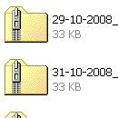
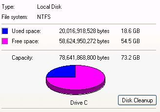
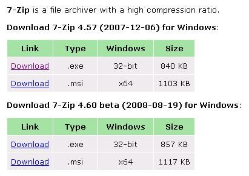
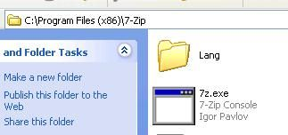
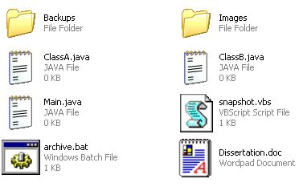
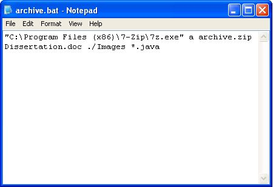
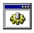
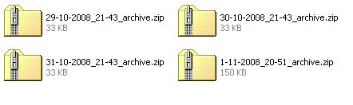
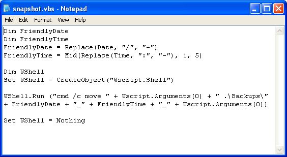

# Archive2 Installation and Usage

Writing a software project on WIndows? Want access to all your old versions? Don't want to have to say "Oh man, I just lost a week's work" ever again? You need version control and automated backups.

A little background: I wrote this simple pair of scripts to save me time and effort at work. I am currently working on a software project that needs frequent rebuilding, so wrote my own custom build script. After the second or third time I accidentally overwrote my most recent changes and lost some small amount of work, I decided that I wanted to back up every time I built the thing.

Secondly, now that the project is being distributed and others are testing it, I get bug reports saying "I found this bug using the version from the 18th of August, can you reproduce it and fix it?". I need to be able to do that, so needed an easily accessible copy of the older versions of the project to recreate bugs on.

Having stored versions of your old code also makes fixing regressions (breaking things that you previously had working) a snap- you flick back through your old versions to find the point at which one version works and the one after it doesnt, find the differences between the two and your problem will be right there.

I decided to write this up 

  1. to share my work with people who might appreciate it
  2. lest anyone suggest all I do is bitch about Instructables about batch files and never contribute any useful ones myself.

**Please Note:** I have licensed this as "all rights reserved" because it's possible that my employer owns the IP to this project, not me. As such I can't license it for modification and redistribution, so please don't redistribute this code. If you want to point people in the direction of the Instructable, however...

## Step 1: You will need

- **A command line zip program.** I use 7zip because it's free and easy to use from the command line.

- **Windows.** I am aiming this at WIndows because that's what I have the code for, and I'm sure there are plenty of scripts like this one for Linux already. The idea would work just as well in Linux but you'd probably have to translate the batch file and VB Script so it's hardly worth the bother.

- **Hard disk space.** This isn't an incremental backup, it's a naive save-the-whole-lot-every-time backup. Hard disk space is cheap, but if your project is very large or you want to back up twenty times a day for a whole academic year then you might have some hard disk space issues. Worst comes to worst, buy a spindle of CD-Rs and shift your backups onto one of those when you hit 600mb or so.

## Step 2: Install your zip program

Not much to say here- install your zip program of choice and note down the full path to the executable file.

## Step 3: Part 1: archive.bat

For the purposes of the rest of this Instructable I will assume that you have a set of .Java source files, a work-in-progress dissertation (Dissertation.doc) and a folder full of resource files (\Images). These illustrate the three main types of things you are likely to want to backup.

If all you want is to create a nice tidy archive that you can put somewhere safe, all you need is this one-line batch file.

    C:\Program Files (x86)\7-Zip\7z.exe a archive.zip Dissertation.doc *.java .\Images

Save that as a file called "archive.bat" in the directory containing the files to back up or download the heres-one-I-made-earlier below, and in the next step we'll customise it to your requirements.

[archive.bat](src/archive.bat)

## Step 4: Customising archive.bat

It's quite unlikely that your files are exactly the same as mine, so now I'll cover how to tweak this batch to your requirements.

To address the parts of the code from left to right:
- **C:\Program Files (x86)\7-Zip\7z.exe** - run the archiver. Replace with the path you found earlier.
- **a** - tell 7zip we want to add these files to an archive.
- **archive.zip** - the filename that 7zip will create.
- **Dissertation.doc** - a single file name to add
- **\*.java** - a wildcard that will add all files that end in ".java".
- **.\Images** - a directory reference that will add the Images directory to the archive

If there are too many files or file types to put on a single line, you can break it up into multiple lines- called 7z a (existing archive name) will add the files to the one already in the archive. If you were writing a C project you could use

    7za a archive.zip *.c7za a archive.zip *.h7za a archive.zip *.rc
    
etc.

## Step 5: Creating unique archive names

If all you wanted was something to prevent the tedium of manually zipping up all those files, archive.bat will do. I like to keep all my saved versions in one place, however, and you can't have a hundred files all called archive.zip- there's no way to tell them apart, for you or for Windows.

To rectify this problem, we will add a short VB Script to the mix that will save your newly created archive in a backups folder with a unique filename.

VBScript is a touch more complex than batch files, but the good news is this bit has even less to customise than archive.bat and it's entirely plausible that you could use the exact code I put here without any modifications. For the next step I will assume that you want to store your backups in a folder called Backups, with the time and date of creation in the filename to help you find the right archive.

## Step 6: Part 2: snapshot.vbs

Snapshot.vbs is a visual basic script that takes the archive, adds the current time and date to the file name, and puts it away in a dedicated backups directory.

The code:

    Dim FriendlyDate
    Dim FriendlyTimeFriendlyDate = Replace(Date, "/", "-")
    FriendlyTime = Mid(Replace(Time, ":", "-"), 1, 5)
    Dim WShellSet WShell = CreateObject("Wscript.Shell")
    WShell.Run ("cmd /c move " + Wscript.Arguments(0) + " .\Backups\" + FriendlyDate + "_" + FriendlyTime + "_" + Wscript.Arguments(0))
    Set WShell = Nothing

To use this, we call "snapshot.vbs archive.zip" and the archive will be timestamped and moved to the backups directory. To automate this process, add "snapshot.vbs archive.zip" to archive.bat on the second line. archive.bat should now read

    "C:\Program Files (x86)\7-Zip\7z.exe" a archive.zip Dissertation.doc ./Images *.javasnapshot.vbs archive.zip

with your customisations to the first line. (See archive2.bat attached to this step)

If you have chosen to name your zip something other than archive.zip, put in your zip name here instead.

[archive2.bat](examples/archive2.bat)
[snapshot.vbs](src/snapshot.vbs)

## Step 7: snapshot.vbs explained

Again, I'll run through the code of snapshot.vbs. You don't have to know VBScript inside-out to understand this file, although basic knowledge will help.

    Dim FriendlyDate
    Dim FriendlyTime
    FriendlyDate = Replace(Date, "/", "-")
    FriendlyTime = Mid(Replace(Time, ":", "-"), 1, 5)

This creates two variables, FriendlyDate and FriendlyTime, and sets them to the current date and time. The replace functions are there because the date in VBSCript is represented in the form 28/11/2008, but Windows doesn't like the slash characters in a file name, so they are replaced with dashes. The same is done to the : characters in the time (12:34:56). The Mid command also strips off the seconds from the time, so "28/11/2008_12:34:56" becomes "28-11-2008_12-34".

    Dim WShellSet WShell = CreateObject("Wscript.Shell")

This part is creating a shell object, effectively a command prompt for VBScript, so that it can use command line commands like "move".

    WShell.Run ("cmd /c move " + Wscript.Arguments(0) + " .\Backups\" + FriendlyDate + "_" + FriendlyTime + "_" + Wscript.Arguments(0))

This tells VBScript to issue a move command to its command line object. To break this line down further would require me to get into the details of how VBScript handles strings so I will refrain from doing that. Essentially, WScript.Arguments(0) becomes the filename you passed to the script earlier (archive.zip) and FriendlyDate and FriendlyTime become the actual text value of the date and time, for instance "18-10-2008" and "14-30". The plus characters join the various bits together into one long string.

The final command that is passed to the command line looks like
**move archive.zip .\Backups\18-10-2008_14-30_archive.zip**. If you want to save your backups into a different location then you can change the name of the folder from ".\Backups\" to, for instance, "E:\My_Lovely_Version_Control\". If you don't want the time stamps, then you can remove the "+ FriendlyTime" but then only one archive per day can be stored (any further backups will overwrite the existing archive).

## Step 8: Possible uses

- To keep a single backup a folder of images

        --archive.bat:--
        "C:\Program Files (x86)\7-Zip\7z.exe" a archive.zip C:\Pictures\pr0n\*.jpgsnapshot archive.zip
    
        --snapshot.vbs:--
        Dim WShellSet WShell = CreateObject("Wscript.Shell")
        WShell.Run ("cmd /c move " + Wscript.Arguments(0) + " C:\Documents\Boring_Financial_Records\Tax_Returns\Tax_Returns.zip"Set WShell = Nothing
    
- To back up a spreadsheet of financial records daily:

        --archive.bat:--
        "C:\Program Files (x86)\7-Zip\7z.exe" a archive.zip C:\Documents\DailyExpenses.xls"snapshot archive.zip
    
        --snapshot.vbs:--
        Dim FriendlyDateFriendlyDate = Replace(Date, "/", "-")
        Dim WShellSet WShell = CreateObject("Wscript.Shell")WShell.Run ("cmd /c move " + Wscript.Arguments(0) + " C:\Documents\Boring_Financial_Records\Tax_Returns\Tax_Returns.zip"Set WShell = Nothing

I'm sure you get the idea- replace the bits of the code that determine the file names it deals with with your own, that's all it needs.

